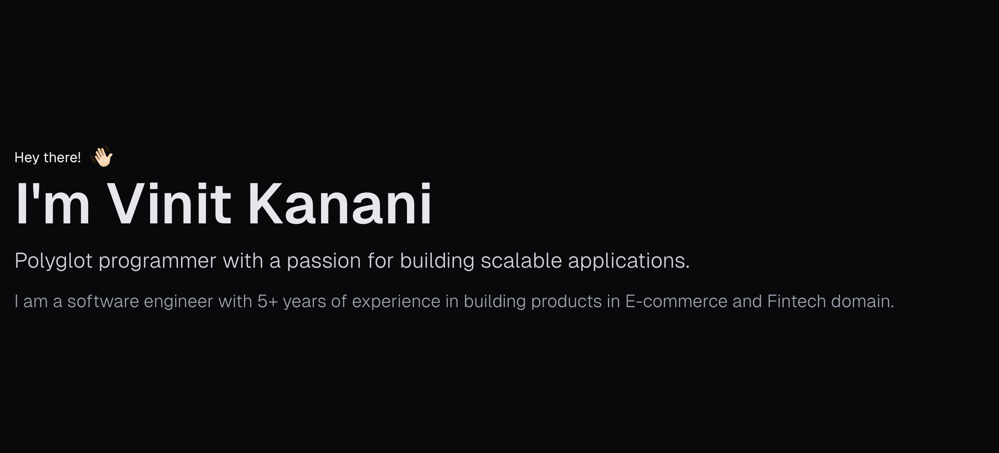

### Hey there! 👋   
## I'm Vinit Kanani
### Polyglot programmer with a passion for building scalable ML applications.
#### I am a software engineer with 5+ years of experience in building products in E-commerce and Fintech domain.

## Skills
- **Programming Languages:** Javascript, Typescript, Python, Golang, Kotlin, Java, C++, C#, HTML/CSS, SQL
- **AI/ML:** PyTorch, Tensorflow, SpaCy, LangChain, Keras, Scikit-learn, Hadoop, Spark, Databricks, PySpark
- **Frontend:** React, Next.js, Vue.js, Redux, Angular, Tailwind CSS, Jest, Playwright, D3.js, Jest, Selenium, Webpack, Rollup, Mocha
- **Backend:** Django, Flask, Spring, Spring Boot, Hibernate, Express, FastAPI, GraphQL, RabbitMQ, Kafka, gRPC, REST APIs
- **Cloud:** Docker, Terraform, Kubernetes, CI/CD, AWS(ECS, EC2, SQS, SNS, Lambda, RDS, DynamoDB, S3, EKS, ALB)
- **Database:** MongoDB, PostgreSQL, MySQL, Redis, Elasticsearch, Snowflake
- **Tools & Technologies:** Git, New Relic, SumoLogic, Swagger

## Contact
- **Email:** iamvinitk@outlook.com
- **LinkedIn:** https://www.linkedin.com/in/iamvinitk/
- **PortFolio** https://iamvinitk.tech/

# ✨🅾🅿🅴🅽 🆃🅾 🅽🅴🆆 🅾🅿🅿🅾🆁🆃🆄🅽🅸🆃🅸🅴🆂 ✨

